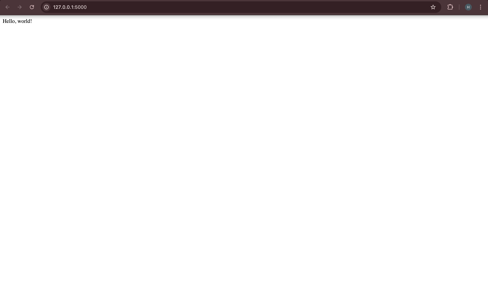

# docker learning

Through this module, I progressed from running a simple web application locally to building, managing, and deploying multi-container applications using Docker. This repository documents the practical steps I followed and the concepts I learned along the way.

---

## 1. Local Flask Application

I started by creating a basic Python web application using Flask and running it directly on my local machine on port 5000. This helped me understand the application behaviour before introducing Docker.

- File: `app.py` (using `from flask import Flask`)
- Port: 5000

 
Flask app running locally in the browser


---

## 2. Containerising the Application

Next, I learned that a Dockerfile acts as a recipe for building a Docker image.

I created a Dockerfile for the Flask app and built my first Docker image using:

```bash
docker build -t hello-flask .
docker run -d -p 5000:5000 hello-flask
```

I then ran the container in detached mode and mapped the container port to my local machine: docker run -d -p 5000:5000 hello-flask 
Key takeaways:
	•	-d runs the container in detached mode (background)
	•	-p maps the container port to the host port
	•	The Flask application now runs fully inside a Docker container

Screenshot:
	•	Dockerfile1.png – Dockerfile for the simple Flask web application

    dockercompose1.png – Docker Compose file linking Flask and MySQL

    ## 🔗 PART 3 — DOCKER COMPOSE + AWS ECR

```md
---

## 3. Multi-Container Application with Docker Compose

To manage applications with multiple services, I used Docker Compose. This allowed me to define and run multiple containers together using a single configuration file.

In this setup, I linked:
- A Flask web application
- A MySQL database
- A custom Docker network to allow container communication

I started the full application stack using:

```bash
docker compose up -d ```

## 🚀 PART 4 — MULTI-STAGE BUILDS + TAKEAWAYS


## 5. Optimising Image Size with Multi-Stage Builds

I implemented a multi-stage Docker build to reduce the final image size. This approach separates the build environment from the runtime environment, resulting in a smaller and more efficient production image.

Screenshot:
- multistage.png – Multi-stage Docker build configuration

---

## Key Takeaways

1. Containers package applications and their dependencies, ensuring consistency across environments.
2. Dockerfiles define how images are built and how containers run.
3. Docker Compose simplifies managing multi-container applications.
4. AWS ECR enables storing and deploying container images in the cloud.
5. Multi-stage builds are a best practice for creating lean, production-ready images.

This hands-on journey from a local Flask app to containerised, multi-service applications gave me a solid foundation in core Docker workflows used in DevOps.