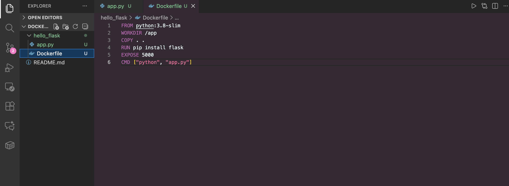
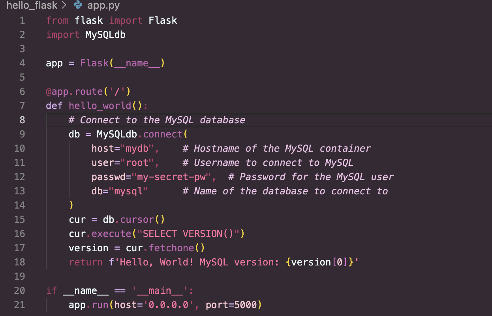
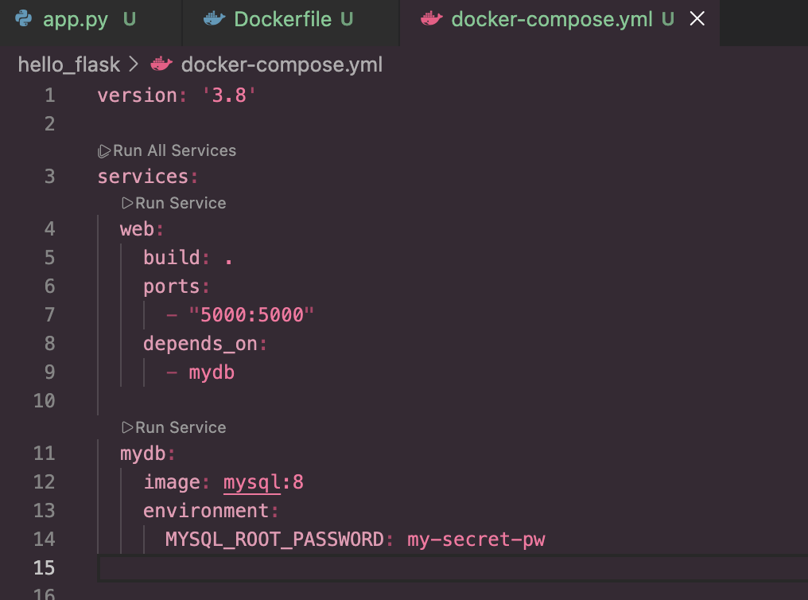
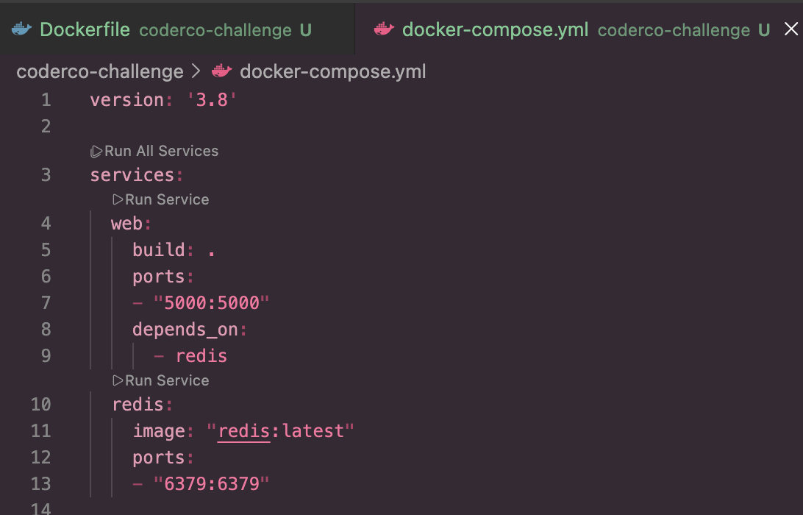
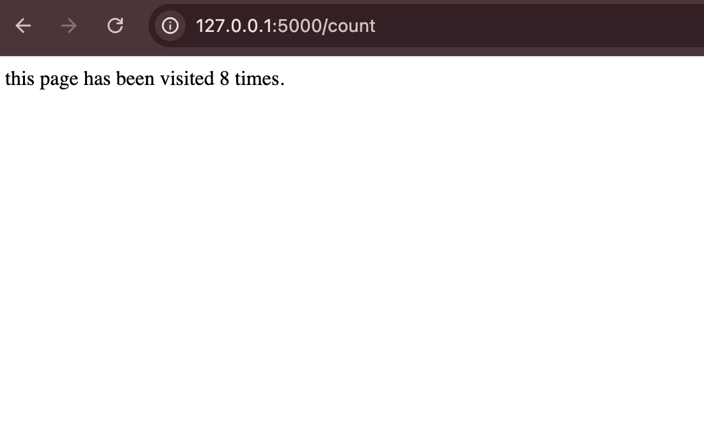
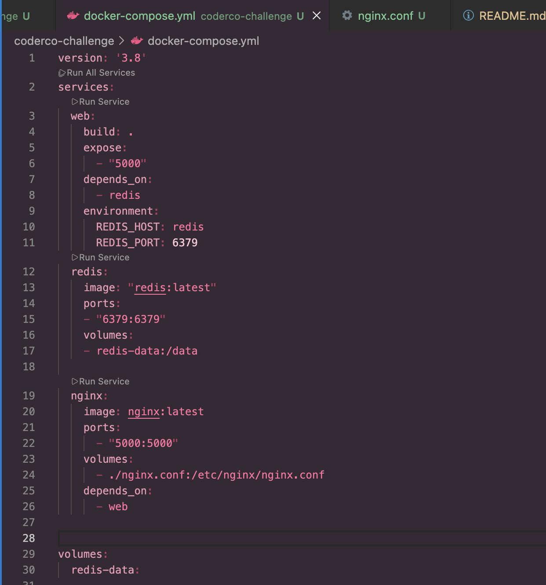

# Docker learning

Through this module, I progressed from running a simple web application locally to building, managing, and deploying multi-container applications using Docker. This repository documents the practical steps I followed and the concepts I learned along the way.

---

## 1. Local Flask Application

I started by creating a basic Python web application using Flask and running it directly on my local machine. This helped me understand the application behaviour before introducing Docker.

- File: `app.py` (using `from flask import Flask`)


 
Flask app running locally in the browser


## 2. Containerising the Flask Application

After confirming the Flask application worked locally, I containerised it using Docker.

I created a Dockerfile, which acts as a recipe for building a Docker image. From the same directory as the Dockerfile, I built the image and tagged it:
```bash
docker build -t hello-flask . 
```
 then ran the image as a container, mapping port 5000 on my local machine to port 5000 inside the container and running it in detached mode:
```bash
docker run -d -p 5000:5000 hello-flask
```


## 3. linking containers 

I connected my python web app to a MySQL database running in another Docker container. I updated the Flask app so it can talk to the MySQL container using the container name. The app runs a simple query to get the MySQL version and shows it on the web page with the Hello World message. This shows how two Docker containers can communicate with each other.



## 4. Docker compose 
I created my first docker-compose.yml file to run my Flask app and MySQL database at the same time. This file defines both services in one place, so I do not need to start each container manually.

The web service is built from the Dockerfile in the current directory and runs on port 5000. It depends on the database service, which means Docker Compose starts the MySQL container first. 



## 5. Pushing and Using Docker Images with AWS ECR

I created a private repository in AWS Elastic Container Registry ECR to store my Docker images. After creating the repository, I authenticated Docker with AWS and pushed my Flask MySQL Docker image to ECR. This allowed me to store the image securely in AWS instead of Docker Hub.


## 6. Optimising Docker Images with Multi Stage Builds

I optimised my Flask MySQL Docker image by using a multi stage build. The original image was very large because it included build tools and dependencies that were only needed during the build process. This made the image slow to build and unnecessary heavy.

I updated the Dockerfile to use multiple stages. The first stage is used to build the application and install all required dependencies. The final stage only includes the files and dependencies needed to run the application. This removes unnecessary tools from the final image.

Using a multi stage build significantly reduced the image size, making it faster to build, pull, and deploy. This is an important optimisation technique used in real world DevOps environments.


# CoderCo challenge 

## Flask and Redis Multi-Container App

I built a simple Flask web app connected to a Redis database to count page visits. The app has a welcome page and a `/count` page that increases the visit number each time it is refreshed.

I used Docker Compose to run both the Flask app and Redis together. Docker Compose automatically created a shared network, which allowed the Flask container to connect to the Redis container using the service name. This removed the need to manage networking manually and made the setup much simpler.

This shows how Docker Compose can be used to run multiple containers that communicate with each other as one application.




---

## Bonus Tasks

### Redis Persistent Storage with Docker Volumes

I added persistent storage to the Redis container so the data is not lost when the container stops or restarts. By default, Redis data inside a container is temporary, so I updated the Docker Compose file to use a Docker volume.

The volume is mounted to the Redis data directory, which allows Redis to save its data outside the container on the host machine. After this change, the visit count no longer resets when the containers are stopped and started again. The counter continues from the previous value, showing that the data is being stored persistently.

This demonstrates how Docker volumes are used to keep data safe in multi-container applications, which is important for real-world and production setups.

---

### Using Environment Variables for Configuration

I updated the Flask application to use environment variables for the Redis connection instead of hard-coding the host and port. The app now reads the Redis host and port from environment variables, with default values if they are not provided.

I also updated the Docker Compose file to pass these environment variables into the Flask container. This allows the Redis connection details to be changed without modifying the application code.

This makes the application more flexible and closer to real-world production setups, where configuration is handled through environment variables rather than hard-coded values.



---

### Scaling Flask with NGINX Load Balancing

I scaled the Flask service to run multiple instances using Docker Compose. To avoid port conflicts when scaling, I updated the web service to expose the application port internally instead of binding it directly to the host.

I added NGINX as a reverse proxy and load balancer in the Docker Compose setup. NGINX listens on a single host port and distributes incoming traffic across all running Flask containers. Docker's internal networking and service discovery allow NGINX to automatically route requests to each Flask instance.


**Code used to scale:**
```bash
docker-compose up --scale web=3 --build
```